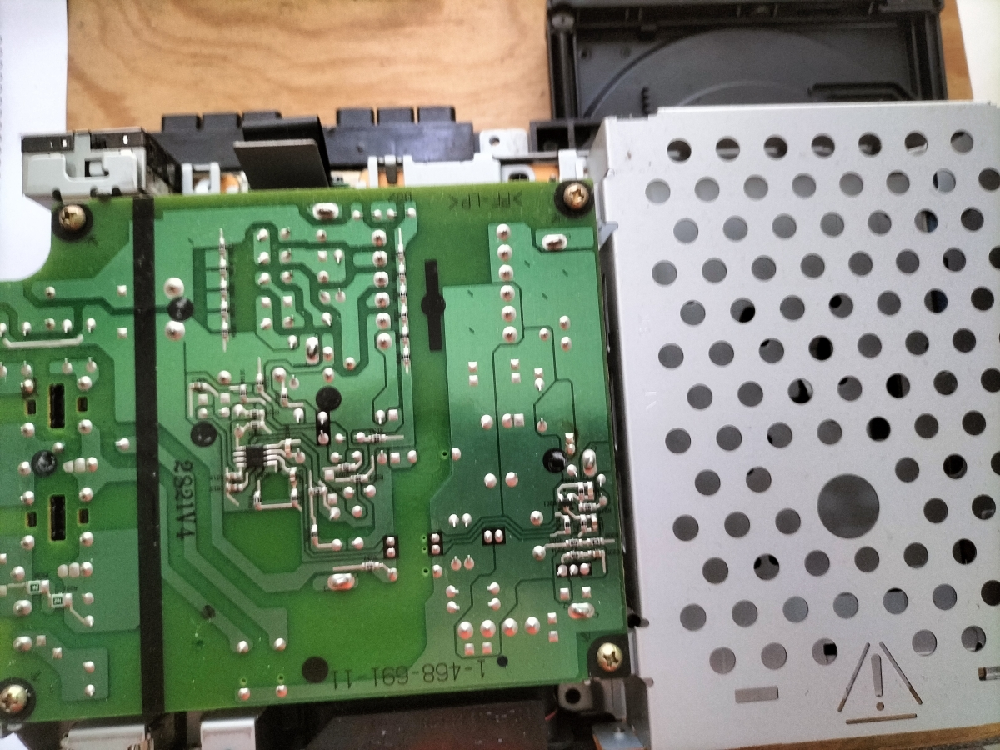

# A refurbishment of an old PlayStation 2 from a thrift store

## Introduction

This is an attempt of refurbishing an old PlayStation 2 that was found in a thrift store.

One fine day in mid-December 2024, I sauntered into a thrift store and found this thing sitting on the shelf.

At first, I thought, "who would want it anyway?" and I circled around the store to see if this is *actually* worth it or not.

After recalling that the system was one of the [world's best selling consoles](https://sea.ign.com/news/222804/sony-confirms-the-playstation-2-has-sold-over-160-million-consoles-worldwide) and many of my friends used to have these, I bought that thing immediately.

It was those consoles that many kids and teenagers were pestering their parents to buy them. It is *indeed* some really hot stuff back then!

It's only about $12 (about RM55) and I'm curious if that would even work at first run?

Yes, after bringing it back home and wiped the whole thing with a damp cloth as the warehouse is pretty dusty, the first thing is I plug this thing in and pressed "On".

Guess what? It didn't start. Yep, I *knew* it all along! No power light, no activity.

Besides, that DVD player tray got stuck. I yanked it and shoved it and didn't budge. This could be another problem too!

At its back, the model number is **SCPH-39003** and it is a PAL model. Upon searching the net for useful information, this console was [manufactured circa 2002-2003](https://consolemods.org/wiki/PS2:Model_Differences#SCPH-390xx_(2002-2003)).

## Disassembly

After watching a few Youtube videos on PS2 disassembly, I attempted to dismantle the thing one part by one part.

If the thing wouldn't start, and not even the Red power LED in front is lit, that could be pointing towards the faulty PSU (power supply unit).

Removing all the plastic casing, I took out the PSU, and laid it on a table separately.

Unfortunately, **it smelled like shit**. Even after washing my hands with soap for 4-5 times, I could still smell that awful old capacitor stench.

Look at that! I don't know if that whole PSU is broken, or a couple of things inside it were broken.

Again, checking some Youtube videos on PS2 power supply repair, the **first well known problem are the fuse and the capacitors**. 

If that aren't the capacitors that cause the problem, I suggest **replacing the entire PSU**!

## PSU Capacitor Replacement

# Caution! If you are *not* confident with the PSU repair, do skip this part and replace the PSU.
# Please exercise safe electrical procedures when attempt to replace the capacitors inside!
# Do not remove the capacitors immediately after the unit is powered off!
# Do not touch the terminals of the capacitors immediately after the unit is powered off! Discharge them safely before working with them! There are lethal voltages inside!

These capacitors, inside the red squares are replaced. They are situated at the +12V white connector at the top right.

Using a vaccuum desoldering gun or pump, I managed to yank out these caps. One of these caps has the legs bent before it get soldered onto the pads, and removing them is a challenge.

With [cheap desoldering needles](https://www.aliexpress.com/item/32574393988.html) I got from China, poking the terminal when the solder gets runny helps in the removal of the cap.

Of course, the solder won't stick on the needles, and I can easily push the legs and out the cap go!

Once I have removed these caps and identified the values of the caps, I purchased new ones and replaced them.

The PSU should output approximately +12V. If it's a +12V on the multimeter, the PSU is working fine!

# Caution: Please keep your hands off the PSU board when it is running!

Oh, and separately I tested one of the removed capacitors by using the method in the [Youtube video](https://www.youtube.com/watch?v=115erzCCxgE&pp=ygUZY2FwYWNpdG9yIGVzciBtZWFzdXJlbWVudA%3D%3D).

A good one would show small consistent spikes on the oscilloscope. A bad one looks like this:

After confirming the +12V is working, I assembled it back (not including the casing), and yes! It could switch on for the first time!

The red LED will be on if there is a +12V supply. Pressing it again gives a green LED output, indicating a running PS2.

## CR2032 battery replacement and some housekeeping

To have the PS2 keeping the correct time and date, it is usual for me to replace the battery too:

As expected the battery is really low. I took it out and replace it with a fresh new Ikea battery:

Apart from that battery replacement, I used some compressed air blower and an anti-static brush to dust off the board.

Here, I also *noticed* something - the console is *unmodded*! There are lack of wires and extra circuit boards on the console mainboard.

It is very suspected that the thing was imported from Europe. The thrift store I visited have all the old junk from Europe, especially England.

In the place where I'm staying (SE Asia), PS2s here are usually heavily modded to... *well you know the whole story. I don't have to explain it here again!*

## Readjusting the DVD player tray

The jammmed tray would not eject even after pressing the eject button.

The DVD player can be disassembled too and the tray is taken out and then reinserted.

Fortunately for me, after reinserting the tray and did some minor cleaning, the tray can be ejected without any problems.

## Testing stage

After all these are done, I reassembled it back and got myself a cheap PS2 controller and the PS2 video cable from a store nearby.

The unit can be switched on and it can enter the basic PS2 menu. I set all the time, date and all the other options.

However, one of the controller slot was not working. Hmm... I suspect that the ribbon cable terminals is pretty in a mediocre condition.

Using the **pencil eraser** to **rub the contacts** and then **some alcohol wipes**, I put it back in and the controller 1 port works fine now!

The end of that ribbon connector mentioned is connected to the controller and memory card slot module (red rectangle):

With both controllers working, I have also tested the DVD player by putting an old Scooby Doo compilation DVD I got from the thrift store too.

The movie player is functioning, and even the Vivaldi CD that I bought in 2007 worked perfectly too.

### Prolonging the life of the DVD player

Since the console accepts most PS2 games in the DVD format, it is usual that the lens and the mechanical parts of the DVD player to have a significant wear and tear.

To preserve the player, playing these games through the hard disk or the external flash memory is a better alternative.

The clones of the PS2 hard disk (GameStar) can be easily found online:

Since I have many old SATA HDDs lying around, I recycled my old Hitachi Travelstar 5K750 and connected it to the adapter, and put the entire adapter back into the PS2.

By using an app called "[FreeMcBoot](https://israpps.github.io/FreeMcBoot-Installer/test/8_Downloads.html)" we can play the games through the HDD instead.

However, this app must be loaded into the PS2 memory card through the DVD image for the "FreeMcBoot".

The "FreeMcBoot" for DVD is [not compatible](https://github.com/CTurt/FreeDVDBoot/issues/271) with my console's DVD version which is **2.13E**:

To have the newest FreeMcBoot 1.966 installed into my memory card and FreeHdBoot 1.966 without the DVD, I did:

*Note: These instructions are simplified!*

1. Get the ["FreeHdBoot Noobie Package"](https://www.ps2-home.com/forum/viewtopic.php?t=3578) and put that image into the HDD.
2. Place that HDD back into the PS2 and let it enter the FreeHdBoot. Have the new and empty memory card into one of the slots.
3. At the same time download the latest version of the [FreeMcBoot (1.966)](https://israpps.github.io/FreeMcBoot-Installer/test/8_Downloads.html) and put it into a flash drive.
4. Extract the FreeMcBoot zip into the same flash drive. Unplug it from the PC and then put it back to the PS2.
5. Inside the **LaunchELF**, go to the `mass:/FMCB-1966` and launch the `FMCBInstaller.elf`. You will enter the installer.
6. In the installer, just pick `Install`, and then `Normal`.
7. Once your memory card is deployed with the FreeMcBoot, restart the system again with the empty HDD.
8. When you entered the FreeMcBoot 1.966 for the first time, go to the same installer as of no. 5.
9. Instead of pressing `Install` - press `R1` on your controller to install it to the HDD.
10. Once it is installed, you can load new games inside by removing the HDD and connecting it to the PC and using the "[HDL Dump Helper GUI](https://www.psx-place.com/resources/hdl-dump-helper-gui-for-linux-windows-by-simon.707/)".
11. If you have done loading games, reinsert the HDD back into the PS2 and run `OPL` from the menu. Enjoy the games!
