# Another refurbishment of a broken PlayStation 2 bought from online

## Introduction

After the [successful repairs of the unit I got earlier](README.md), I'm curious if I could try to fix another one which have a similar problem.

Some time later I got this one from the local Carousell - it mentioned about the console couldn't start at all and is sold for about $11. So I took that risk and bought it. From my guess it could be a simple problem such as a broken capacitor in the PSU, or more sinister problems lurking ahead such as broken processor or RAM (or its combination).

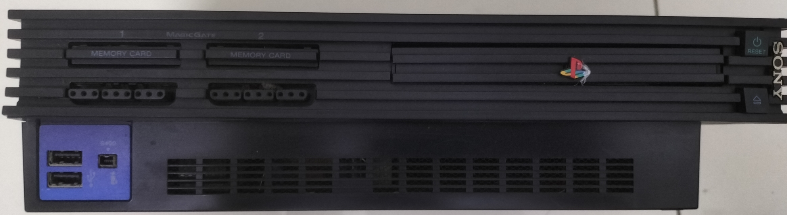

When I got it, it looks pretty clean, but I got a lot of rattling inside when I move it. There are broken screw posts and its bits. I did glue them back with a super glue.

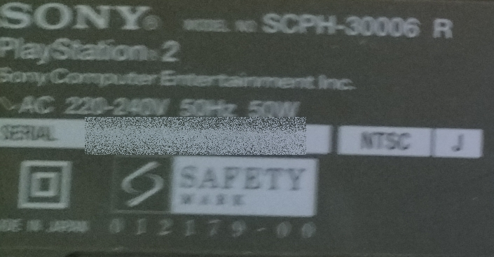

At its back, the model number is **SCPH-30006R** and it is an NTSC model. Upon searching the net for useful information, this console was [manufactured circa 2001-2002](https://consolemods.org/wiki/PS2:Model_Differences#SCPH-300xx(R)/350xx_(2001-2002)).

## Could it start? Nope!

As the listing in Carousell, this thing wouldn't start. There's the red LED being on at the power button, and I can start it, but there's nothing on the screen. The PSU is fine, and I wouldn't need to replace capacitors this time around!

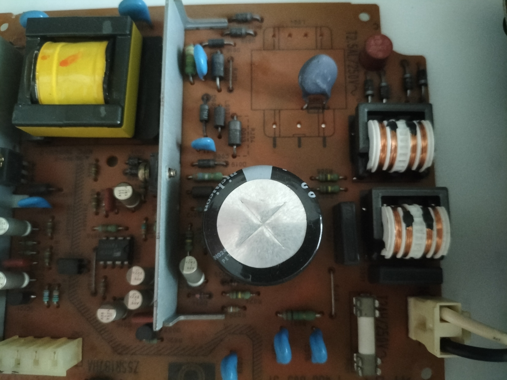

## Disassembly

Since it is not an imported model like what I did earlier, this thing is *highly suspected to be modified with a modchip*! 

Yes, I guessed it right. In SE Asia, that's what I often see too:

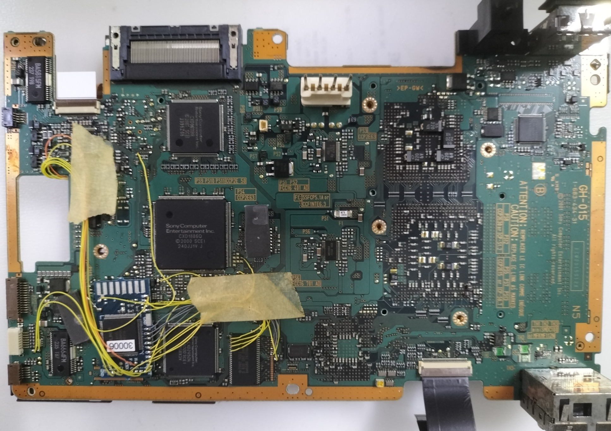

There are cables snaking around the board and it is connected to a little blue PCB with an AMD Xilinx XC95144XL CPLD inside. Searching for this modchip online, I got even more information from [this webpage](https://www.ps2-home.com/forum/app.php/page/modchips-bluechip-ps2-modchips-installation-diagrams). It is a [V5/V6](https://www.ps2-home.com/forum/download/file.php?mode=view&id=9373) for the GH-015 PCB. I suspect the thing fails to run because the modchip's ground wires got snapped from the main PCB.

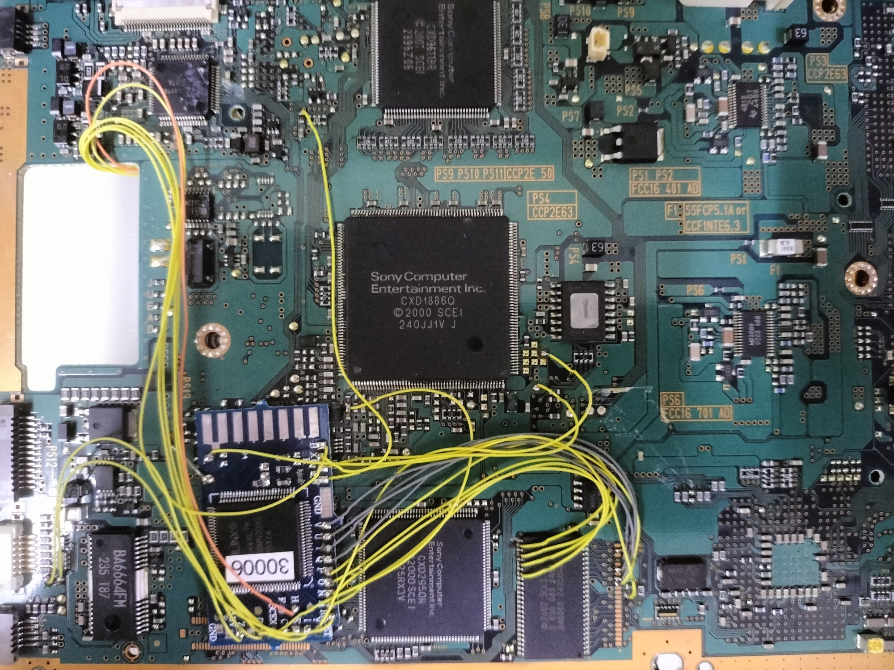

As much as I would love to keep this thing around, there are better alternatives of running games from the DVD.

I desoldered all the wires from both sides of the PCB, slowly cleaning the area with some alcohol wipes, and removed the modchip board that is glued on top the DRAM.

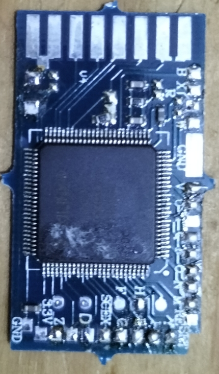

## CR2032 battery replacement and some housekeeping

As usual, the battery is already dead. There is a ton of CR2032 batteries I got from Mr. DIY and that fixed the problem.

Also, I brushed out most of the dust on the board using an anti static brush. 

The console's metal parts are mostly oxidized. This is because the console is located in a very warm and humid area.

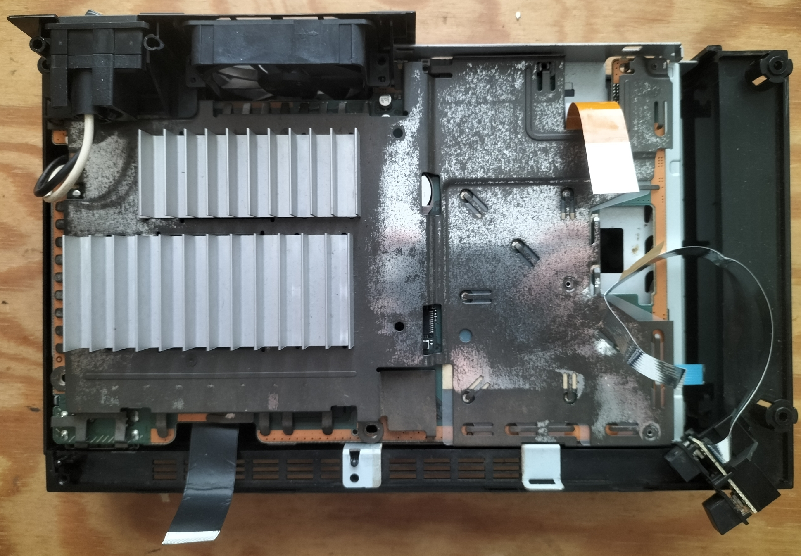

## Testing stage (still in progress!)

After removing the modchip and did the housekeeping, I'm glad that the unit started as usual! Unfortunately it doesn't really cooperate well with the PS2-HDMI converter so I have to use the normal PS2-AV cable for this one.

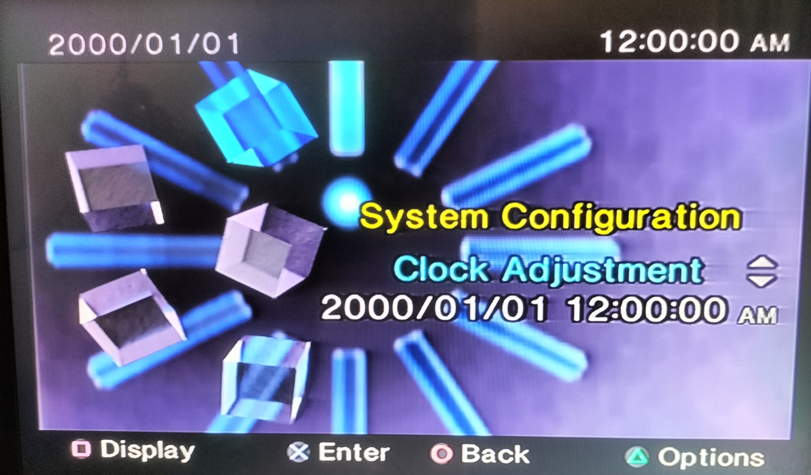

However, there are a lot of *broken things inside* like the on/off ribbon cable that got frayed and snapped later when I'm doing further work on it!

Also, that frayed controller ribbon cable really sucked! That thing fell out the controller port many times and I used a cut transparency acetate to jam it into the slot for better support. One of the memory card slot doesn't work, and the other controller port might be intermittent. It worked for a while but now the console just refused to start afterwards! 

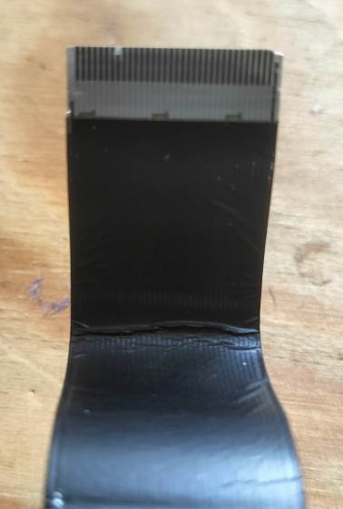

I took the flex cable out and noticed that the terminals are peeled! Not a good one, so I ordered a couple more from Lazada!

Besides that this frayed flex cable might have blown one of the fuses (**PS007**) that are responsible for providing the rumble to the controller. Testing it with a multimeter, there's no continuity. Armed with kapton tapes (the rest of the surrounding components surrounding it are tiny and I don't want excess molten solder accidently touching them) and soldering iron, I removed it, and ordered a couple more from AliExpress:

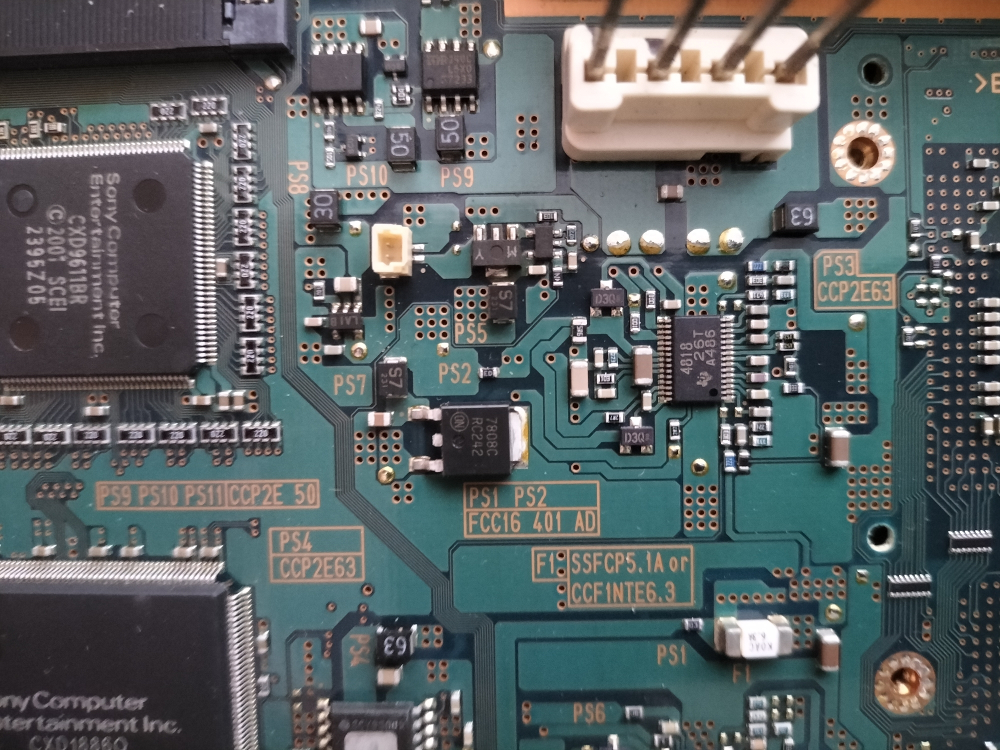

When it is arrived, I'll resolder the new one back to the board of course!

Apart from that the console runs as usual, I had some hours playing games on it and it did not act up or whatever it is.

## DVD player

Nothing good to say about it - it refused to fully spin up despite after re-lubricating the moving parts with help from a family member, and even cleaning the lens. Plus it made a loud rattling noise when the console is started.

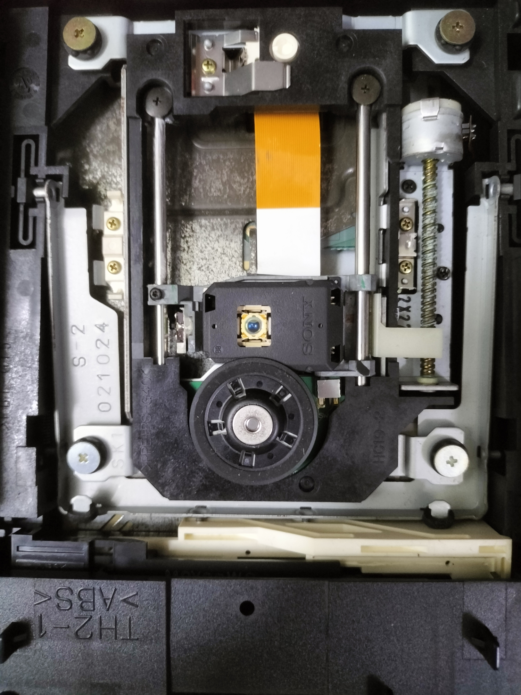

I have no plans of repairing it since I'm running it through the HDD.

## FreeMcBoot notes

This one does not boot up with the FreeMcBoot 1.966 memory card unfortunately.

On the HDD side it works well with ["FreeHdBoot Noobie Package"](https://www.ps2-home.com/forum/viewtopic.php?t=3578).